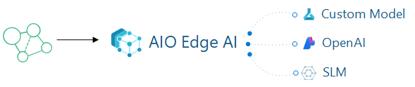

# Azure IoT Operations with AI in-a-box


## Background
The "AIO with AI in-a-box" project is a comprehensive toolkit designed to help users deploy AI and machine learning solutions at the edge efficiently especially in combination with [Azure IoT Operations](https://learn.microsoft.com/en-us/azure/iot-operations/) - AIO. The "AIO with AI in-a-box" includes a modular framework that enables the integration and management of AI models on edge devices (hybride) with AIO, bridging the gap between cloud-based AI models and local OT systems. With a focus on low-latency environments, this allows developers to build and deploy machine learning models directly to hybride edge devices with AIO. This makes it highly relevant for industries looking to integrate AI on the shopfloor, offering scalable, adaptable, and secure AI capabilities in distributed environments.



This accelerator contains a minimal AIO (Azure IoT Operations/Kubernetes) configuration that enables:

* **Azure ML to AIO** - Orchestration of resources for the entire Edge AI model lifecycle with AIO (Azure IoT Operations enabled by ARC), including creation, deployment, and proper packaging through Azure ML, AIO and ARC . This involves leveraging key components such as AIO, Arc-Enabled Kubernetes Cluster, Azure ARC, Azure ML and Azure ML CLI V2 notebooks.

* **AIO with Azure Open AI** - Deployment and enablement of ***[Cerebral](https://github.com/Azure/arc_jumpstart_drops/tree/main/sample_app/cerebral_genai)*** to demonstrate how to leverage Azure OpenAI and Natural Language Processing (NLP) within an AIO environment.

* **AIO with SLMs (RAG) on Edge** Deployment and Enablement of Small Language Models (SLMs) at the Edge within an AIO environment. This setup integrates SLMs to enable Retrieval-Augmented Generation (RAG) at the edge, optimizing performance and reducing reliance on cloud resources for a more efficient and responsive AIO deployment.

### Why with Microsoft Azure IoT Operations?

[Microsoft Azure IoT Operations](https://learn.microsoft.com/en-us/azure/iot-operations/)  is ideal for manufacturing because it provides local processing power with (hybride) edge computing capabilities, enabling data processing for faster decision-making on the factory floor. It supports key industrial standards like OPC UA and MQTT, ensuring seamless integration with a wide range of manufacturing equipment and systems. The platform’s scalability makes it suitable for businesses of any size, whether managing a single facility or a global network of factories. By leveraging artificial intelligence and machine learning, Azure IoT allows manufacturers to gain deeper insights into production trends, enabling advanced analytics and proactive quality management.

### Use cases for this solution
Here are some example use cases that can be achieved with this solution.

#### Quality control
 The solution enhances quality control in manufacturing by enabling monitoring of production parameters using sensor data or camera technolgoy. With advanced AI and machine learning models trained in Microoft Azure, this solution can detect anomalies, such as defects or deviations from quality standards, early in the production process. This proactive approach reduces the risk of defective products reaching customers, thereby minimizing waste and rework.

#### Energy Management
It can enables manufacturers to implement effective energy management strategies by providing monitoring of energy consumption across production lines and facilities. Through advanced analytics, it can identifies energy inefficiencies, enabling the implementation of corrective actions that reduce waste and optimize energy use. These insights not only lower operational costs but also support ESG (Environmental, Social, and Governance) initiatives by helping manufacturers minimize their carbon footprint.

#### Faster insights with Factory Copilot
The factory copilot on the Edge can leverages data processing in the factory, providing operators and managers with actionable insights, alerts, and recommendations through a centralized dashboard. This digital assistant can proactively suggest process optimizations, highlight potential issues, and guide operators through complex tasks. With AI-driven analytics and natural language interfaces, the copilot improves situational awareness and empowers factory personnel to make data-driven decisions quickly. This synergy results in smoother operations, reduced downtime, and enhanced productivity across the production line.


### High level Architecture
Below is the global architecture of this accelerator. The core solution runs on an Ubuntu-based virtual machine using K3s. Alternatively, you can deploy this solution to a dedicated hybrid edge device, allowing the machine learning model to operate closer to your equipment.
 

### The above architecture is explained step-by-step below:
1. You create all your necessary Azure Resources
    * (K3s Cluster, Azure ML Workspace, Container Registry, Storage, Edge VM (for testing), and Azure ML Extension)
1. Within Azure ML Studio you start creating/working your model:
    1. Connect to Azure Machine Learning Workspace
    2. Grab your Training Data and create your JSONL and MLTable(s)
    3. Create your Compute so you can train your data
    4. Configure and run the AutoML training job
    5. Convert model to appropriate format (Onnx) if necessary
    6. Using MFLow Retrieve the Best Trial (Best Model's trial/run)
    7. Register best Model and Deploy
    8. Test: Visualize Model Results
1. Once you have your model you deploy it to your AIO K3s Cluster
    1. You will build your model into a docker image and place that image in your container registry
    1. Using Azure ML Extension you will leverage the Azure ML Extension to pull the appropriate model from ACR into your K3s Cluster
    
[](./readme_assets/?)

## Getting started
The following steps are needed to install this solution:

1. [Deploy the solution](./deployment.md) to Microsoft Azure
2. [Post deployment ](./postdeployment.md)
3. [Run and test the solution](./runsolution.md)

 

### Resources that will be deployed:
 

## Prerequisites
* An [Azure subscription](https://azure.microsoft.com/en-us/free/).
* Install latest version of [Azure CLI](https://docs.microsoft.com/en-us/cli/azure/install-azure-cli-windows?view=azure-cli-latest)
* Install [Azure Developer CLI](https://learn.microsoft.com/en-us/azure/developer/azure-developer-cli/install-azd)
* Enable the Following [Resource Providers](https://learn.microsoft.com/en-us/azure/azure-resource-manager/management/resource-providers-and-types) on your Subscription:
    - Microsoft.AlertsManagement
    - Microsoft.Compute
    - Microsoft.ContainerInstance
    - Microsoft.ContainerService
    - Microsoft.DeviceRegistry
    - Microsoft.ExtendedLocation
    - Microsoft.IoTOperations
    - Microsoft.IoTOperationsDataProcessor
    - Microsoft.IoTOperationsMQ
    - Microsoft.IoTOperationsOrchestrator
    - Microsoft.KeyVault
    - Microsoft.Kubernetes
    - Microsoft.KubernetesConfiguration
    - Microsoft.ManagedIdentity
    - Microsoft.Network

* Install latest version of [Bicep](https://docs.microsoft.com/en-us/azure/azure-resource-manager/bicep/install)

* Install the following [Azure CLI Extensions](https://learn.microsoft.com/en-us/cli/azure/azure-cli-extensions-list): 
    * az extension add -n [azure-iot-ops](https://github.com/azure/azure-iot-ops-cli-extension) --allow-preview true 
    * az extension add -n [connectedk8s](https://github.com/Azure/azure-cli-extensions/tree/main/src/connectedk8s) 
    * az extension add -n [k8s-configuration](https://github.com/Azure/azure-cli-extensions/tree/master/src/k8sconfiguration) 
    * az extension add -n [k8s-extension](https://github.com/Azure/azure-cli-extensions/tree/main/src/k8s-extension) 
    * az extension add -n [ml](https://github.com/Azure/azureml-examples)

 * Ensure that the user or service principal you are using to deploy the accelerator has access to the Graph API in the target tenant. This is necessary because you will need to:
    - Export **OBJECT_ID** = $(az ad sp show --id bc313c14-388c-4e7d-a58e-70017303ee3b --query id -o tsv)
    - Make sure you retrieve this value from a tenant where you have the necessary permissions to access the Graph API. 
    - https://learn.microsoft.com/en-us/azure/azure-arc/kubernetes/custom-locations
    - https://learn.microsoft.com/en-us/cli/azure/ad/sp?view=azure-cli-latest

## Deployment Flow 

**Step 1.** Clone the [Edge-AIO-in-a-Box Repository](https://github.com/Azure-Samples/edge-aio-in-a-box)

**Step 2.** Create Azure Resources (User Assigned Managed Identity, VNET, Key Vault, Ubuntu VM, Azure ML Workspace, Container Registry)

**Step 2.** Configure Ubuntu VM

**Step 3.** Buld ML model into docker image

**Step 4.** Push model to Azure Container Registry

**Step 5.** Deploy model to the Edge via Azure IoT Operations

## Deploy to Azure
1. Clone this repository locally: 

    ```bash
    git clone https://github.com/Azure-Samples/edge-aio-in-a-box
    ```

1. Log into your Azure subscription  (both are required): 
    ```bash
    azd auth login --use-device-code --tenant-id xxxxxxxx-xxxx-xxxx-xxxx-xxxxxxxx
    ```
    ```bash
    az login --use-device-code --tenant xxxxxxxx-xxxx-xxxx-xxxx-xxxxxxxx
    ```

1. Deploy resources:
    ```bash
    azd up
    ```

    You will be prompted for a subcription, region and additional parameters:

    ```bash
        adminPasswordOrKey - Pa$$W0rd:)7:)7
        adminUsername - ArcAdmin
        arcK8sClusterName - aioxclusterYOURINITIALS
        authenticationType - password
        location - eastus
        virtualMachineName - aiobxclustervmYOURINITIALS
        virtualMachineSize - Standard_D16s_v4
    ```


## Post Deployment
Once your resources have been deployed you will need to do the following to get the notebook(s) up running in Azure ML Studio and your Edge Kubernetes Pod to see the solution flows:

* When running the notebooks in AML your user (jim@contoso.com for instance) won't have permission to alter the storage account or add data to the storage. Please ensure that you have been assigned both **Storage Blob Data Reader** and **Storage Blob Data Contributor** roles.

* Run the Notebook(s) 
    * ***[1-Img-Classification-Training.ipynb](/notebooks/1-Img-Classification-Training.ipynb)***
    * This notebook has been automatically uploaded to a folder named EdgeAI within your Azure ML workspace. Its purpose is to guide you through building a custom model in Azure ML, registering the model, and deploying it to a container or endpoint in your Arc-enabled Kubernetes cluster using the Azure ML Extension. Additionally, you can test the endpoint using a Postman collection available in the postman folder within the repository.

## Deployment Issues
 - export OBJECT_ID = $(az ad sp show --id bc313c14-388c-4e7d-a58e-70017303ee3b --query id -o tsv)
 - You need to make sure that you get this value from a tenant that you have access to get to the graph api in the tenant. 
 - https://learn.microsoft.com/en-us/azure/azure-arc/kubernetes/custom-locations
 - https://learn.microsoft.com/en-us/cli/azure/ad/sp?view=azure-cli-latest

### Disclaimer
The lifecycle management (health, kubernetes version upgrades, security updates to nodes, scaling, etc.) of the AKS or Arc enabled Kubernetes cluster is the responsibility of the customer.

All preview features are available on a self-service, opt-in basis and are subject to breaking design and API changes. Previews are provided "as is" and "as available," and they're excluded from the service-level agreements and limited warranty.

## Support

We are always looking for feedback on our current experiences and what we should work on next. If there is anything you would like us to prioritize, please feel free to suggest so via our GitHub Issue Tracker. You can submit a bug report, a feature suggestion or participate in discussions.

## How to Contribute

This project welcomes contributions and suggestions. Most contributions require you to agree to a Contributor License Agreement (CLA) declaring that you have the right to, and actually do, grant us the rights to use your contribution. For details, visit <https://cla.opensource.microsoft.com>

When you submit a pull request, a CLA bot will automatically determine whether you need to provide a CLA and decorate the PR appropriately (e.g., status check, comment). Simply follow the instructions provided by the bot. You will only need to do this once across all repos using our CLA.

This project has adopted the [Microsoft Open Source Code of Conduct](https://opensource.microsoft.com/codeofconduct/). For more information see the [Code of Conduct FAQ](https://opensource.microsoft.com/codeofconduct/faq) or contact <opencode@microsoft.com> with any additional questions or comments.

## Key Contacts & Contributors

Highlight the main contacts for the project and acknowledge contributors. You can adapt the structure from AI-in-a-Box:

| Contact            | GitHub ID           | Email                    |
|--------------------|---------------------|--------------------------|
| Andrés Padilla | @AndresPad | anpadill@microsoft.com |
| Victor Santana | @Welasco | vsantana@microsoft.com |
| Chris Ayers | @codebytes | chrisayers@microsoft.com |
| Neeraj Jhaveri | @neerajjhaveri | nejhaver@microsoft.com |
| Nabeel Muhammad | @nabeelmsft | munabeel@microsoft.com |
| Ali Sanjabi | @asanjabi | alsanjab@microsoft.com |
| João Carlos Santos | @jomacedo | jomacedo@microsoft.com |
| Georgina Siggins | @georgesiggins | gsiggins@microsoft.com |
| Remco Ploeg | @rploeg | remcoploeg@microsoft.com |
| Armando Blanco Garcia | @armandoblanco | armbla@microsoft.com |
| Cheng Chen | @ChenCheng368 | chencheng@microsoft.com |


## License

This project may contain trademarks or logos for projects, products, or services. Authorized use of Microsoft trademarks or logos is subject to and must follow [Microsoft's Trademark & Brand Guidelines](https://www.microsoft.com/en-us/legal/intellectualproperty/trademarks/usage/general). Use of Microsoft trademarks or logos in modified versions of this project must not cause confusion or imply Microsoft sponsorship. Any use of third-party trademarks or logos are subject to those third-party's policies.